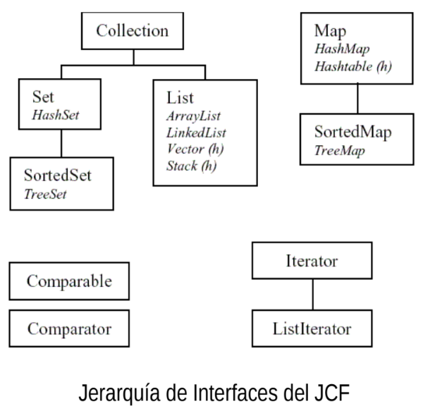

# EPD1
## Objetivos:
- Introducir el concepto de colección.
- Crear programas que manejen y procesen colecciones de elementos.

## 1. Colecciones

Una tarea muy común a la que se enfrentan los programadores durante el desarrollo de programas es la organización y
manipulación de conjuntos de datos. En la forma más simple y menos potente, cuando los datos de un conjunto son del mismo tipo,
éstos son organizados en vectores. Si bien los vectores son adecuados para manipular y organizar ciertos tipos de datos, éstos no
suelen ser la mejor opción para programas en los que se manipulan y organizan conjuntos de datos de tamaño variable, programas
en los que se necesita acceso rápido a datos concretos o programas en los que los conjuntos de datos presentan algunas
restricciones.

Una de las estrategias de desarrollo de programas más en boga en la actualidad es el desarrollo orientado por patrones de diseño.
Esta técnica se basa en la identificación de prácticas, estructuras y decisiones en el diseño de programas que proceden de la
experiencia del desarrollo de muchos proyectos en los que han resultado ser de mucha utilidad. Para el problema que se ha
planteado anteriormente, la organización y manipulación de conjuntos de datos, se ha demostrado muy efectivo un patrón que
define lo que se conoce como colecciones de elementos. Éstas son estructuras abstractas de datos que permiten manipular
cómodamente conjuntos de datos haciendo que el programador no tenga que preocuparse de los detalles de funcionamiento interno
para que se realicen las operaciones más comunes, como por ejemplo añadir un dato al conjunto, eliminarlo, acceder a un dato
concreto, etc.

Los desarrolladores de Java incluyeron dentro del paquete básico de desarrollo un conjunto de clases e interfaces que conforman el
soporte para colecciones a partir de la versión 1.2 (ya se disponía de una versión primitiva y menos potente en el Java original, pero
ésta quedó obsoleta). A este conjunto de clases e interfaces se le conoce como Java Collection Framework (JFC) y están
organizadas de la siguiente forma:



JCF permite manejar tres tipos de colecciones:

- **Listas**: En este tipo de colecciones los elementos tienen una determinada posición asociada dentro de la colección ya que
se respeta el orden en el que éstos han sido incluidos. Las listas son unas estructuras parecidas a los vectores ya que los
elementos de los vectores tienen asociada también una posición.

- **Conjuntos**: Son colecciones que no admite elementos repetidos, es decir, no admite contener dos o más veces el mismo
objeto. Además, en estas colecciones un elemento no tiene asociada una posición concreta dentro de la colección, es
decir, no se respeta el orden en el que han sido incluidos los elementos.

- **Colecciones** asociativas: En este tipo de colección es obligatorio que un elemento esté asociado a un valor que lo
identifica, al que se llama clave. Para acceder a los elementos de la colección se empleará la clave. Este tipo de
colecciones son similares a un vector, sólo que en lugar de tener índices numéricos que vayan de 0 a n-1, siendo n el
tamaño del vector, para el acceso a los datos, tiene claves (similares a los índices pero no necesariamente numéricas)
que son valores especificadas por el usuario.

Los conjuntos y colecciones asociativas tienen una versión no ordenada, en la que los elementos de la colección no necesitan tener
un orden determinado entre ellos, y una versión ordenada, en la que los elementos deben mantener un orden definido por un
criterio determinado en su representación en memoria.

JCF incluye las siguientes interfaces para manipular los anteriores tipos de colecciones:

- **Collection**: Define los métodos básicos para la manipulación de colecciones. De ella heredan las interfaces Set y List.
- **Set**: Interfaz que incluye los métodos necesarios que ha de implementar una colección de tipo conjunto.
- **SortedSet**: Interfaz para la versión ordenada de conjuntos.
- **List**: Esta interfaz define los métodos necesarios para manipular una colección de tipo lista.
- **Map**: La interfaz incluye los métodos que serán necesarios para manipular una colección asociativa.
- **SortedMap**: Interfaz para la versión ordenada de colecciones asociativas.

Como se ha visto, cada interfaz representa a un tipo de colección. Hay que recordar que las interfaces no implementan nada, si no
que imponen obligaciones a las clases para que implementen ciertos métodos. JCF incluye varias clases que implementan estas
interfaces. Estas clases son las que realmente nos permiten manipular y representar colecciones. Dichas clases, organizadas según
la interfaz que implementan, son las siguientes:

| Interfaz | No ordenada | Ordenada |
| -------- | ----------- | -------- |
| Set | HashSet |TreeSet|
| List| ArrayList/LinkedList | |
| Map | HashMap | TreeMap |


- Las clases cuyo nombre comienzan por el <u>prefijo **Hash**</u> son clases que están **implementadas** usando una <u>tabla asociativa o tabla
hash</u>
- Las que comienzan con el <u>prefijo **Array**</u> están **implementadas** <u>empleando un vector</u>
- El <u>prefijo **Tree**</u> indica que la clase está **implementada** <u>empleando una estructura de árbol</u>
- <u>**LinkedList**</u> está **implementada** <u>empleando una lista enlazada</u>.

**Además** de las anteriores interfaces y clases, **JCF incluye un grupo de interfaces de soporte** <u>útiles para recorrer colecciones y
establecer criterios de ordenación entre los elementos</u>. 

Estas interfaces son las siguientes:

- **Iterator**: Esta interfaz define métodos de utilidad para recorrer colecciones.
- **ListIterator**: Esta interfaz define los métodos necesarios para recorrer los elementos de una colección de tipo lista.
- **Comparable y Comparator**: Estas interfaces definen los métodos necesarios para poder comparar dos elementos de una
colección entre sí, y así poder determinar el orden entre ellos.

Junto con los anteriores elementos, JCF incluye una serie de clases cuyo uso actual no está recomendado. Estas clases provienen
de versiones anteriores de Java y se incluyen por motivos de compatibilidad para que las aplicaciones escritas para versiones
anteriores de Java sigan funcionando.

En próximos guiones se estudiarán las diferentes interfaces para cada tipo de colección. Hasta entonces, para crear una colección
emplee el constructor sin argumentos de la clase ArrayList y emplee una referencia cuyo tipo sea Collection. 

Por ejemplo, para crear una colección apuntada por una referencia c emplearemos la siguiente sentencia:

```java
Collection c = new ArrayList();
```

Recuerde que las interfaces y clases de JCF están incluidas en el paquete java.util, por lo que cada fichero de código fuente que
haga uso de ellas deberá incluir una sentencia import para incluir dichas clases e interfaces similar a la siguiente:

```java
import java.util.*;
```
## 2. Interfaz Collection

Como ya se ha comentado anteriormente, la <u>interfaz Collection define los métodos generales que ha de implementar cualquier
colección</u> **excepto** las <u>colecciones asociativas</u>. Estos métodos son los siguientes:

- Métodos para **agregar** y **eliminar** elementos:
    * **boolean add(E element)**: Añade un elemento a la colección, devolviendo verdadero si fue posible añadirlo y falso en caso contrario. Un ejemplo de una situación en la que no se puede añadir un elemento a una colección puede ser el caso en el que se intente incluir un elemento a un conjunto al que ya pertenece el elemento. Recuerde que como un conjunto no admite tener elementos duplicados esta operación no se podría realizar.

    * **boolean remove(Object element)**: Elimina de la colección el elemento que se pasa como argumento. Si el elemento está duplicado sólo lo elimina una vez. Devuelve falso si el elemento especificado no existe en la colección y verdadero en caso contrario.

- Métodos para **realizar consultas**:
    * **int size( )**: Devuelve el número de elementos de la colección.
    * **boolean isEmpty( )**: Devuelve verdadero en el caso de que la colección esté vacía.
    * **boolean contains(Object element)**: Devuelve el valor verdadero si el objeto que se pasa como argumento es un elemento de la colección.

- Métodos para **recorrer todos los elementos**:
    * **Iterator<E> iterator( )**: Devuelve una referencia a un iterador de la colección. Un iterador permitirá recorrer la colección obteniendo cada uno de los elementos y borrar elementos. Este método se estudiará en profundidad en la sesión correspondiente en la que se estudiará el concepto de iterador.

- Métodos para realizar **varias operaciones simultáneamente**:
     * **boolean containsAll(Collection<?> collection)**: Indica si todos los elementos de la colección que se pasa como argumento son miembros de la colección que invoca el método.
    * **boolean addAll(Collection<? extends E> collection)**: Añade todos los elementos de la colección que se pasa como argumento a la colección que invoca el método.
    * **void clear( )**: Elimina todos los elementos de la colección que invoca el método.
    * **void removeAll(Collection<?> collection)**: Elimina de la colección que invoca el método todos los elementos que pertenecen a la colección que se pasa como argumento.
    * **void retainAll(Collection<?> collection)**: Elimina todos los elementos de la colección que invoca el método excepto aquellos elementos que pertenecen a la colección que se pasa como argumento.

- Otros Métodos:
    * **Object[ ] toArray( )**: Permite convertir la colección que invoca el método en un vector de objetos de la clase Object. Este método se empleará para acceder a los elementos contenidos dentro de una colección hasta que se estudie el concepto de iterador.

Observe que la interfaz Collection trata los elementos de una colección como objetos de la clase Object, ya que todas las clases
heredan implícitamente de dicha clase.

Como se ha indicado anteriormente, la forma natural de acceder a los elementos de una colección es mediante iteradores. Hasta
que este concepto se estudie en posteriores sesiones, el acceso a los elementos de una colección se realizará convirtiendo ésta a
un vector, y posteriormente accediendo a los elementos del vector resultante.

## 3. Concepto de Iterador

Una de las tareas más básicas que un programa realiza sobre las colecciones es recorrerlas con el objetivo de realizar alguna
operación con sus elementos. Los iteradores de colecciones están concebidos precisamente para facilitar esta tarea.

Un iterador es un patrón de software, muy utilizado en desarrollo de programas orientado por patrones de diseño, que define una
interfaz que contiene los métodos necesarios para **acceder de forma secuencial** a los elementos de una colección. Los iteradores
son objetos que implementan la citada interfaz. Como objetos poseen un estado que permite controlar qué elementos de la
colección se han recorrido y cuáles quedan por recorrer.

Siempre que necesite recorrer los elementos de una colección debe usar un iterador.

#### 3.1 La interfaz Iterator

El anterior concepto de iterador es el que se emplea para el acceso a las colecciones en Java. Para este fin, JCF incluye la interfaz
Iterator. Los objetos que implementan esta interfaz permiten acceder secuencialmente a los elementos de una colección. 

Los métodos incluidos en la interfaz Iterator son los siguientes:

- **public Object next( )**: Este método devuelve una referencia al siguiente elemento de la colección que se está recorriendo.
Si el iterador se acaba de crear, el método devolverá una referencia al primer elemento de la colección. Si ya se han
recorrido todos los elementos de la colección y se llama a este método se lanzará una excepción de la clase
NoSuchElementException, hija de la clase RuntimeException. Observe que este método devuelve una referencia de la
clase Object, por lo que deberá hacer un casting para disponer de una referencia a la interfaz de los elementos de la
colección.
- **public boolean hasNext( )**: El método indica si hay un elemento posterior al último que se obtuvo llamando al método next.
Devolverá verdadero mientras queden elementos por recorrer en la colección y falso cuando la colección se haya
recorrido entera.
- **public void remove( )**: Este método permite eliminar de la colección el último elemento cuya referencia devolvió el método
next. Este método es la forma más segura para eliminar elementos de una colección mientras ésta es recorrida, ya que
asegura que ésta queda en un estado coherente. Recuerde que este método sólo puede ser llamado una vez por cada
llamada al método next, es decir, no intente borrar un mismo elemento de la colección varias veces. En caso de que se
llame al método varias veces para una sola llamada a next o que se llame al método antes de la primera llamada a next,
se lanzará una excepción de la clase IllegalEstateException. Este método es opcional para los iteradores, ya que puede
no estar disponible en algunas implementaciones, como por ejemplo en las colecciones que no permitan modificar sus
objetos, en cuyo caso se lanzará una excepción de la clase UnsupportedOperationException. Ambas clases de
excepciones son hijas de la clase RuntimeException.

Para obtener un iterador, la colección tiene que invocar el método iterator de la interfaz Collection que devuelve una referencia de
tipo Iterator. Por ejemplo:

```java
Collection c = new ArrayList();
...
Iterator it = c.iterator();
```

Una vez se ha obtenido un iterador para una colección de elementos de tipo IElemento, se suele aplicar el siguiente patrón de
código para recorrer la misma:

```java
while(it.hasNext()){
IElemento ele = (IElemento) it.next();
... // Procesamiento del elemento devuelto por it.next()
}
```

En este caso hay que hacer un casting ya que los elementos de la colección son Object. Si declaramos una colección utilizando
genéricos podemos ahorrarnos un casting. Por ejemplo:

```java
Collection<Integer> col2 = new ArrayList<Integer>();
for (Iterator<Integer> iterator = col2.iterator(); iterator.hasNext();)
    Integer elemento = iterator.next();
```

## Experimentos

### Experimento 1
Ejecute el siguiente programa y observe cómo se crea y se rellena una colección de elementos, así como el uso de varios
métodos de utilidad de la interfaz Collection.

```java
import java.util.*;
public class Experimento1 {
    public static void main(String[] args){
    Collection c = new ArrayList();
    System.out.println("La colección tiene " + c.size() + " elementos");
    if(c.isEmpty()){
        System.out.println("La colección está vacía");
    }
    for(int i=0;i<5;i++) // Añadimos elementos a la colección
        c.add(i*3);
        System.out.println("La colección tiene " + c.size() + " elementos");
        System.out.println("La colección contiene: " + c);
    }
}
```

¿Cómo podemos modificar el código para que la sea una colección de enteros?

### Experimento 2
Estudie el funcionamiento del siguiente código y prediga antes de ejecutarlo su salida por pantalla.
```java
import java.util.*;
public class Experimento2 {
    public static void main(String[] args){
        Collection c = new ArrayList();
        Collection d = new ArrayList();
        for(int i=0;i<5;i++){ // Añadimos elementos a las colecciones
            c.add(i*3);
            d.add(3.1416 * i);
        }
        System.out.println("La colección c contiene: " + c);
        System.out.println("La colección d contiene: " + d);
        d.addAll(c);
        System.out.println("Despues de d.addAll(c) la colección d contiene: " + d);
        d.retainAll(c);
        System.out.println("Despues de d.retainAll(c) la colección d contiene: " + d);
        d.removeAll(c);
        System.out.println("Despues de d.removeAll(c) la colección d contiene: " + d);
    }
}
```

Modifique el código para que c sea una colección de enteros y d sea una colección de cadenas. ¿Por qué ahora hay errores en el
código? ¿Cómo se pueden solucionar?

### Experimento 3

Observe cómo accede a los elementos de una colección en forma de vector. Solucione el error existente en el código.
```java
import java.util.*;
import poo.io.IO;
public class Experimento3 {
    public static void main(String args[]){
    Collection c = new ArrayList();
    int[] v;
    int elementos;
    System.out.println("Introduzca el número de datos: ");
    elementos = (int) IO.readLine();
    for(int i=0;i<elementos;i++){
        System.out.println("Elemento " + (i+1) + ": ");
        c.add((int)IO.readNumber());
    }
    v = c.toArray();
    for(int i=0;i<v.length;i++)
        System.out.println("Elemento " + (i+1) + ": " + v[i].toString());
    }
}
``` 

### Experimento 4
Analice el siguiente código. Observe cómo se obtiene un iterador para una colección y cómo se recorren los elementos de ésta
haciendo uso de él.
```java
import java.util.*;
public class Experimento4 {
    public static void main(String[] args){
    Collection c = new ArrayList();
    Iterator it; // Referencia al iterador
    for(int i=1;i<=5;i++) // Rellenamos la colección
        c.add(i);
    it = c.iterator(); // Obtenemos un iterador para la colección
    while(it.hasNext()) // Mientras haya más elementos
        System.out.println((Integer)it.next()); // Imprimimos el siguiente elemento
    }
}
```

### Experimento 5
1. Analice el siguiente código que imprime la suma de los pares de elementos de una colección. Observe la forma en la que se
obtienen los elementos de la colección, usando un casting. Ejecute el código para ver el resultado.
```java
import java.util.*;
public class Experimento5 {
    public static void main(String[] args){
        Collection c = new ArrayList();
        Iterator it; // Referencia al iterador
        for(int i=1;i<=10;i++) // Rellenamos la coleccion
            c.add(i);
        it = c.iterator(); // Obtenemos un iterador para la colección
        while(it.hasNext()){ // Mientras haya más elementos
            Integer i = (Integer) it.next();
            Integer j = (Integer) it.next();
            System.out.println(i.intValue()+j.intValue()); // Imprimimos la suma
        }
    }
}
```

2. Cambie el límite del bucle for para que la colección tenga 11 elementos en lugar de 10. ¿De dónde proviene la excepción que se
produce? ¿Qué significa?

3. Modifique el código anterior para que funcione correctamente independientemente del número de elementos de la colección, de
tal forma que se ignore a los elementos no pareados.

4. Modifique el código anterior de tal forma que no sea necesario hacer los castings en bucle que implementa el recorrido de la
colección.

### Experimento 6

1. Analice el siguiente código y determine el objetivo del mismo. Ejecútelo para ver el resultado.
```java
import java.util.*;
public class Experimento6 {
    public static void main(String[] args){
    Collection c = new ArrayList();
    Iterator it; // Referencia al iterador
    for(int i=1;i<=5;i++) // Rellenamos la coleccion
        c.add(i);
    it = c.iterator(); // Obtenemos un iterador para la colección
    while(it.hasNext()){ // Mientras haya más elementos
        Integer i = (Integer) it.next();
        if(i.intValue()%2==0)
            it.remove();
        if(i.intValue()%3==0)
            it.remove();
    }
    it = c.iterator(); // Obtenemos un iterador para la colección
    while(it.hasNext()) // Mientras haya más elementos
        System.out.println((Integer)it.next()); // Imprimimos el siguiente elemento
    }
}
```
2. Varíe el límite del bucle for de tal forma que la colección tenga 10 elementos. ¿Qué ocurre en este caso? ¿Qué significa la
excepción que se produce?

3. Realice los cambios necesarios en el código anterior para que funcione correctamente independientemente de los elementos que
contenga la colección.

4. Modifique el código anterior para no tener que hacer los castings en el bucle while.

## Ejercicios
### Ejercicio 1
1. Cree una interfaz IAlumno para el tratamiento de alumnos. Esta interfaz dispondrá de los métodos consultores y
modificadores para el nombre, apellidos y DNI de un alumno. Además, dispondrá del método toString de tal forma que muestre una
cadena en la que se indiquen todos los datos de un alumno.

2. Cree una clase Alumno que implemente la interfaz IAlumno. La clase dispondrá de atributos para almacenar los apellidos, el
nombre, y el DNI. La clase también dispondrá de un método constructor sin argumentos, que no hará nada, y de un método
constructor con tres argumentos que permitirá inicializar los atributos.

3. Cree una interfaz IGrupoAlumnos para el tratamiento de un grupo de alumnos. La interfaz tendrá los métodos siguientes:
- Un método consultor para un atributo de tipo Collection
- Un método llamado imprimir, que no recibirá argumentos ni devolverá un valor. Este método deberá recorrer el grupo de
alumnos que ha invocado el método imprimiendo por pantalla los datos de cada uno de ellos.
- Un método add que permita incorporar nuevos alumnos a un grupo. Este método recibirá como argumento una referencia
de tipo IAlumno que representa el nuevo alumno a insertar, y lo insertará sólo si dicho alumno no pertenece ya al grupo.
El método devolverá un valor verdadero si se ha podido insertar el alumno o falso en caso contrario.

4. Cree una clase GrupoAlumnos que implemente la Interfaz IGrupoAlumnos. La clase contendrá como atributo una referencia de
tipo Collection que representará una colección de alumnos. La clase dispondrá de un método constructor sin argumentos que
inicializará el atributo de la colección a una colección vacía. Añada a la clase un método estático obtenerGrupoPrueba que se
emplee para obtener un grupo de alumnos de prueba. Este método no recibirá ningún argumento y devolverá una referencia de tipo
IGrupoAlumnos que referenciará a un grupo de alumnos formado por un número determinado de alumnos elegidos por el usuario.
Para su implementación ayúdese del método add del apartado anterior.

5. Cree un programa principal que demuestre el uso de los métodos anteriores.

### Ejercicio 2

1. Añada a la interfaz IAlumno un método consultor y modificador para la edad de un alumno. Haga los cambios
necesarios en la clase Alumno para que siga implementando la interfaz. Modifique también el constructor con argumentos y el
método toString para contemplar estos cambios.
2. Añada a la interfaz IGrupoAlumnos un método eliminarMayoresDe que elimine del grupo de alumnos que invoca el método todos
los alumnos que tengan una edad superior a 30 años. El método no recibirá ningún argumento ni devolverá nada. La clase
GrupoAlumnos debe seguir implementando la interfaz.
3. Cree un programa principal que muestre el funcionamiento del anterior método.

### Ejercicio 3
Modifique el código del ejercicio 1 de la EPD 1 de tal forma que los métodos que recorran las colecciones lo hagan
empleando iteradores.

### Ejercicio 4
Modifique el código del ejercicio 2 de la EPD 1 de tal forma que el método que elimina a los alumnos mayores de 30
haga uso exclusivamente de un iterador, tanto para recorrer la colección como para eliminar elementos.

### Ejercicio 5
1. Cree una clase, y su interfaz asociada, de tal forma que los objetos de la clase representen los resultados de un
partido de fútbol. Estos objetos incluirán en forma de atributos el nombre del equipo local, el nombre del equipo visitante, los goles
del equipo local y los goles del equipo visitante.

2. Cree una clase, y su interfaz asociada, de tal forma que ésta incluya los datos relativos a una jornada de liga de fútbol. Estos
datos serán el número de jornada, que no puede ser negativo (lance una excepción en dicho caso), y el conjunto de resultados de
los partidos de la jornada, en forma de colección de objetos de la clase desarrollada en el apartado anterior. Dote a la clase de
métodos para añadir y eliminar resultados, así como para imprimir los mismos por pantalla.

3. Cree unas clases, y sus interfaces asociadas, similares a las desarrolladas en los puntos anteriores, pero que representen los
resultados de los partidos en forma de quiniela, usando los caracteres ‘1’, ‘X’ o ‘2’.

4. Añada un método en la clase desarrollada en el apartado b, de tal forma que se conviertan los resultados de una jornada de liga
a resultados en forma de quiniela.

5. Cree un programa que demuestre el funcionamiento de los elementos desarrollados.

## Problemas
### Problema 1
1. Añada a la interfaz IGrupoAlumnos un método eliminar que reciba como argumento una referencia a un grupo de
alumnos y no devuelva nada. El método deberá eliminar del grupo de alumnos que invoca a los alumnos del grupo de alumnos que
se pasa como parámetro. Para ello, por cada alumno del grupo de alumnos que se pasa como parámetro se recorrerá el grupo de
alumnos que invoca, y si se encuentra un alumno igual se eliminará dicho alumno.
2. Cree un programa principal para demostrar el funcionamiento del método anterior.

### Problema 2
1. Añada un método eliminarDuplicados a la interfaz IGrupoAlumnos que elimine del grupo de alumnos que invoca el
método aquellos alumnos iguales según su DNI. Este método no recibirá ningún argumento ni devolverá nada.
2. Cree un programa principal para demostrar el funcionamiento del método anterior.

### Problema 3
1. Añada un método a la interfaz IGrupoAlumnos que reciba como argumento una referencia de tipo IGrupoAlumnos
y no devuelva nada. El método sustituirá los alumnos del grupo que invoca por los alumnos del grupo que se pasa como parámetro
que tengan un DNI igual.
2. Cree un programa principal que demuestre el funcionamiento del método anterior. Para hacer pruebas haga que en el grupo de
alumnos que invoca el método haya varios alumnos con DNI igual a otros alumnos del grupo de alumnos que se pasa como
parámetro, pero para los cuales el resto de sus datos sea distinto.

### Problema 4
1. Cree una interfaz IColeccionEnteros para el tratamiento de una colección de números enteros. La interfaz tendrá
los métodos siguientes:
    - Un método consultor para un atributo de tipo Collection
    - Un método llamado imprimir, que no recibirá argumentos ni devolverá un valor. Este método deberá recorrer la colección de enteros que invoca el método mostrándolos por pantalla.
2. Añada un método coincideSumaElementos a la interfaz anterior que reciba un número entero v y devuelva un entero. El método
deberá devolver como resultado el número mínimo de los primeros elementos de la colección de números enteros que hay que
sumar para que la suma coincida con el entero v. Si no es posible conseguir un subconjunto de elementos de la colección que
sumen v entonces el método devolverá -1.

Por ejemplo, si tenemos la colección de enteros {1, -2, 3, -5, 3, 8, 10} y v = 0, entonces el método deberá devolver 5, ya que los 5
primeros números de la colección ( 1 -2 + 3 -5 + 3 ) suman 0. Si para la misma colección v = 7 entonces el método devolverá -1, ya
que en ningún caso una subsecuencia de los elementos de la colección suma 7.

3. Cree un programa que demuestre el funcionamiento de los métodos desarrollados en los puntos anteriores.
4. ¿Seguiría funcionando el método del apartado b si la colección se creara a partir de la clase HashSet en lugar de la clase
ArrayList? Razone la respuesta.

### Problema 5
1. Cree una clase y su interfaz asociada, de tal forma que los objetos de ésta representen una entrada en un
diccionario. Cada entrada estará compuesta por la palabra a definir y la definición de la misma.
2. Cree una clase, y su interfaz asociada, cuyos objetos representen un diccionario. Los objetos de esta clase dispondrán de un
atributo de tipo Collection donde almacenarán las entradas, que serán objetos de la clase desarrollada en el punto anterior. Dote a
la clase de métodos para incluir y eliminar entradas del diccionario, así como de un método para buscar la definición de una
determinada palabra.
3. Cree un programa que demuestre el funcionamiento de las clases anteriores.

### Problema 6
Cree un programa que convierta varias líneas de texto a mayúsculas. Para ello, el programa pedirá al usuario que
indique cuantas líneas de texto se tratarán, a continuación pedirá que se inserte cada una, convertirá cada línea a mayúsculas, y
finalmente imprimirá por pantalla las líneas después de la conversión. Tenga en cuenta que cada línea puede ser representada por
una cadena de texto y el conjunto de líneas puede ser almacenado en una colección.

### Problema 7
Programación en Java 2. Luis Joyanes Aguilar, Ignacio Zahonero Martínez. McGraw-Hill, 2002.
Página 385. Ejercicio 11.18. Use una colección en lugar de un vector.

### Problema 8
Modifique los métodos desarrollado en los problema 2 y 4 usando exclusivamente iteradores.

### Problema 9
Adapte el método desarrollado en el problema 3 d de tal forma que la iteración y borrado sobre las colecciones se
realicen usando exclusivamente iteradores.

### Problema 10
Modifique la clase desarrollada en el problema 5 de tal forma que sus métodos iteren y manipulen los elementos de
la colección empleando sólo iteradores.

### Problema 11
Adapte el código de la clase Diccionario desarrollada en el problema 6 de tal forma que sus métodos accedan a las
entradas del diccionario usando iteradores.

### Problema 12
Cree un programa similar el propuesto en el problema 7 que use iteradores para realizar el acceso a las línea del
texto.

### Problema 13
1. Cree una clase, y su interfaz asociada, que permita representar los datos de una serie de candidatos a piloto de
aviones de combate. Estos datos son el nombre, la altura y el peso.
2. Cree un método estático que reciba una colección de candidatos a piloto de combate y elimine de ésta a aquellos que no
cumplen las condiciones mínimas pare poder serlo. Éstas son, no superar una altura de 1.75, y no tener un peso superior a 70 kg.
3. Cree un programa que demuestre el funcionamiento del método anterior.

