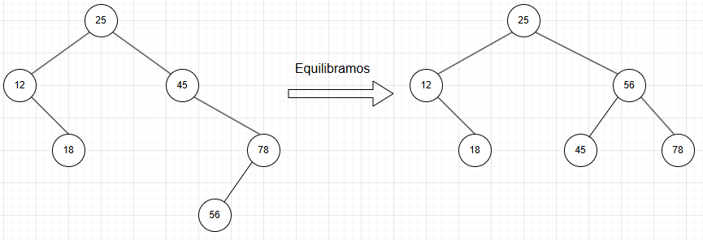
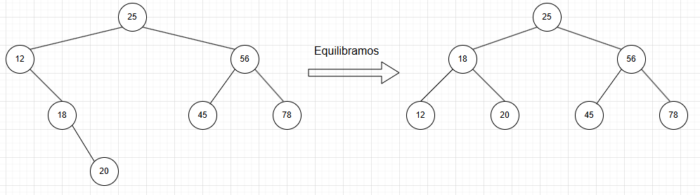
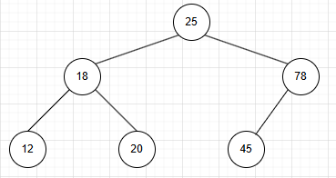
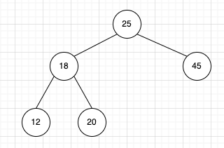
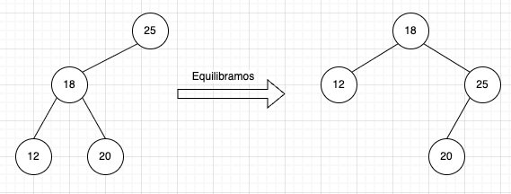

## Ejemplo de Examen Final

### Pregunta 1

Considere el siguientes árbol binario de búsqueda donde las claves son enteros y los cuadrados representan hojas únicas.


a) Representar el árbol binario de búsqueda resultante de ejecutar las siguientes instrucciones.

1. Insertar un nodo con clave 56


2. Insertar un nodo con clave 8


3. Insertar un nodo con clave 32


4. Borrar el nodo con clave 45


5. Borra nodo con clave 12


b) Implemente en lenguaje java o pseudocódigo el algoritmo de búsqueda de una clave en un árbol binario de búsqueda.
```java
Find(K,V){  //K es una clave, V un nodo
    if (V.isExternal()) // Si la raíz(V) es el único elemento del árbol
        return V; // Devolver elemento del nodo
    if( K < V.getElement() )
        return Find(K, V.getLeft());
    else if (K > V.getElement())
        return Find(K, V.getRight());
    else
        return V;      
}
```
### Pregunta 2
Considere ahora el árbol proporcionado en el problema 1 como un árbol AVL

a) Representar el árbol AVL tras ejecutar las siguientes instrucciones:

1. Insertar un nodo con clave 56



2. Insertar un nodo con clave 20



3. Borrar el nodo con clave 56



4. Borrar el nodo con clave 78



5. Borrar el nodo con clave 45



b) ¿Cual es la principal ventaja de un árbol AVL con respecto a un árbol binario de búsqueda?

Los arboles AVL son balanceados, es decir, la diferencia en las alturas de los hijos de v es como máximo 1, lo que garantiza que su orden de complejidad de cualquier búsqueda sea O(log n) en el peor caso. En un ABB su orden de complejidad de cualquier búsqueda es O(n) en el peor caso.

### Pregunta 3

a) Proporciona un código recursivo para borrar todos los elementos de una pila.
```java
vaciarPila(){
    if(pila.top!=null){
        pila.pop();
        vaciarPila();
    }
}
```

b) Proporciona un algoritmo, en java o pseudocódigo, para invertir el orden de los elementos de una cola. 
```java
while(!cola.isEmpty()){
    pila.push(cola.dequeue());
}
while(!pila.isEmpty()){
    cola.enqueue(pila.pop());
}
```

Suponer que la cola Q contiene un conjunto de elementos y que la pila S está vacía.

### Pregunta 4

Considere el siguiente grafo no direccionado


a) Proporcione la **edge list** y la **adjacency matrix** relativas al grafo de la figura. Para la adjacency matrix se puede utilizar la estructura simplificada vista en EPD.

- Edge List: **[(1, 4), (2, 4), (2, 5), (3, 5), (4, 5)]**

- Adjacency List:


- Adjacency Matrix: **La matriz es correcta, con la excepción de que matriz[1][1] debe ser 0.**


b) ¿Como cambian las estructuras del apartado anterior si se ejecutan las siguientes operaciones?

1. Insertar vértice 6
2. Insertar arco (5,6)
3. Insertar arco (4,6)
4. Borra vértice 6

    - Si se ejecutan las operaciones las estructuras anteriores quedan igual que antes de ejecutarse dichas operaciones, porque el vertice 6, que se inserta, despues se borra.

### Pregunta 5

Dada la clase "Persona":
```java
public class Persona implements Comparable{
    String DNI, nombre;
    int edad;

    public Persona(String DNI, int edad, String nombre) {
        this.DNI = DNI;
        this.edad = edad;
        this.nombre = nombre;
    }

    public String getDNI() {
        return DNI;
    }

    public void setDNI(String DNI) {
        this.DNI = DNI;
    }

    public String getNombre() {
        return nombre;
    }

    public void setNombre(String nombre) {
        this.nombre = nombre;
    }

    public int getEdad() {
        return edad;
    }

    public void setEdad(int edad) {
        this.edad = edad;
    }

    @Override
    public boolean equals(Object obj) {
        if (obj == null) {
            return false;
        }
        if (getClass() != obj.getClass()) {
            return false;
        }
        final Persona other = (Persona) obj;
        if (this.DNI == null) {
            if (other.DNI != null) {
                return false;
            }
        } else if (!this.DNI.equals(other.DNI)) {
            return false;
        }
        return true;

    }

    @Override
    public int hashCode() {
        int hash = 5;
        hash = 61 * hash + Objects.hashCode(this.DNI);
        return hash;
    }
    
    @Override
    public String toString(){
        return getNombre();
    }
    
    @Override
    public int compareTo(Object o){
        Persona other = (Persona)o;
        return this.edad-other.edad;
    }
}
```

Escriba las siguientes salida que generaría la ejecución del siguientes código:

```java
public class Principal {

    public static void main(String[] args) {
        // TODO code application logic here
        Persona p1 = new Persona("4444a",25,"Pepe");
        Persona p2 = new Persona("3333b",22,"Maria");
        Persona p3 = new Persona("2222c",27,"Juan");
        Persona p4 = new Persona("2222c",31,"Paco");
        Persona p5 = new Persona("1111d",18,"Cristina");
        
        List <Persona> lista = new ArrayList();
        lista.add(p1);
        lista.add(p2);
        lista.add(p3);
        lista.add(p4);
        lista.add(p5);
        
        System.out.println("Impresion 1: "+lista);
        Set <Persona> conjunto = new HashSet(lista);
        System.out.println("Impresion 2: "+conjunto.size());
        SortedSet <Persona> ss = new TreeSet(lista);
        System.out.println("Impresion 2.b: "+ conjunto);
        System.out.println("Impresion 3: "+ss);
        ss.last().setNombre("Lola");
        System.out.println("Impresion 4.a: "+ss);
        System.out.println("Impresion 4.b: "+lista);
    }
}
```


- Impresión 1: Muestra los nombres de las personas en la lista en el orden en que fueron agregadas, gracias a la implementación del método toString() en la clase Persona.

    Salida: 
    ```
    Impresion 1: [Pepe, Maria, Juan, Paco, Cristina]
    ```
- Impresión 2: Muestra el tamaño del conjunto. Dado que HashSet elimina duplicados basándose en el método hashCode() y equals(), y estos métodos están definidos para considerar solo el DNI de la Persona, el tamaño será 4 porque p3 y p4 tienen el mismo DNI.

    Salida: 
    ```
    Impresion 2: 4
    ```

- Impresión 2.b: Muestra los nombres de las personas en el conjunto. Debido a que HashSet no garantiza el orden, pero p3 y p4 son considerados el mismo objeto, uno de ellos no se incluirá. No podemos predecir el orden de los elementos debido a cómo HashSet maneja internamente los elementos.

    Salida posible (El orden puede variar): 
    ```
    Impresion 2.b: [Pepe, Maria, Juan, Cristina] 
    ```

- Impresión 3: Muestra los nombres de las personas en el TreeSet. TreeSet ordena los elementos según su orden natural definido por compareTo(), que en este caso es la edad. El TreeSet contendrá a las 5 personas, ya que ninguna tiene la misma edad, y las ordenará por edad.

    Salida (dependiendo de cuál objeto con DNI duplicado se agregó primero al TreeSet): 
    ```
    Impresion 3: [Cristina, Maria, Pepe, Juan, Paco]
    ```
    

- Impresión 4.a: ss.last() obtiene la persona con la mayor edad, que es p4 ("Paco", edad 31). Su nombre se cambia a "Lola". El TreeSet mantiene el orden por edad.

    Salida: 
    ```
    Impresion 4.a: [Cristina, Maria, Pepe, Juan, Lola]
    ```

- Impresión 4.b: El cambio realizado en el objeto p4 a través del TreeSet se refleja en la ArrayList original, ya que ambas colecciones contienen referencias a los mismos objetos.

    ```
    Impresion 4.b: [Pepe, Maria, Juan, Lola, Cristina]
    ```
